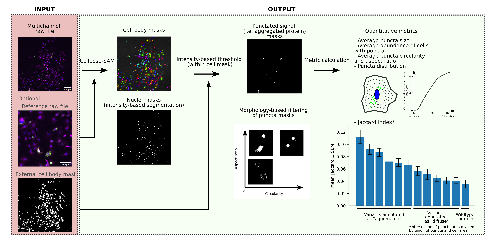

# PARSHO

**PARSHO** is a user-friendly computational toolkit for reproducible, high-throughput analysis of fluorescent puncta in microscopy images. It combines robust cell segmentation with flexible support for external masks and reference-guided segmentation, enabling adaptable analysis across diverse imaging conditions. PARSHO provides comprehensive quantitative metrics through an accessible plug-and-play workflow, reducing reliance on manual analysis and improving reproducibility and scalability.



## Choose your starting point

New to image analysis? Start with Colab. A *channel* is an image of one stain
or signal. A *cell mask* identifies the pixels belonging to each cell.
*Segmentation* finds those cell boundaries; *thresholding* selects bright
pixels within them as candidate puncta. Inspect both before interpreting results.
Want to process data in batches using the standard pipeline? Check the [Simple analysis wrapper](#simple-python-analysis) for how to run the package with as little parameters as possible.

| What you want to do | Start here | What you need |
| --- | --- | --- |
| Analyse your images without writing code | [Open PARSHO in Google Colab](https://colab.research.google.com/github/Fraternalilab/PARSHO/blob/main/notebooks/PARSHO_Colab.ipynb) | A browser and your image files; no local Python installation |
| Run the common workflow in Batch with a few Python parameters | [Simple analysis wrapper](#simple-python-analysis) | Channel files or arrays; defaults cover segmentation, thresholding and radial analysis |
| Learn the workflow on supplied data | [Local notebook tutorials](#local-notebook-tutorials) | A local environment and basic notebook familiarity |
| Use existing cell segmentations or integrate PARSHO into Python | [Python API and external masks](#python-api-and-external-masks) | Aligned image arrays and integer cell labels |

A more detailed documentation can be found at [Documentation](docs/analysis.md).

## No-code analysis in Google Colab

**[Open the guided Colab notebook](https://colab.research.google.com/github/Fraternalilab/PARSHO/blob/main/notebooks/PARSHO_Colab.ipynb)**

Use the play button beside each numbered step, in order. Complete the forms
and uploads before continuing; **do not use “Run all.”** All analysis settings
are labelled checkboxes, dropdowns or numeric fields.

1. **Install and initialise.** Run both setup cells. For faster segmentation,
   select **Runtime → Change runtime type → T4 GPU** if available. CPU also
   works. Installation and the first Cellpose model download can take time.
2. **Upload and preview.** Select one multichannel image or several aligned
   images containing separate channels from the same field. Filenames are
   unrestricted. All [supported formats](#supported-image-formats) are accepted.
   For a first try, click **Try the supplied demo**; its channel roles are
   prefilled. Large files can also be selected from a mounted Google Drive.
3. **Assign channels and settings.** Name each signal, tick the channels to
   combine for cell segmentation, and tick each channel to measure as puncta.
   Select a nucleus channel only if you have one.
   Several puncta channels can be analysed independently.
4. **Choose optional controls.** Start with automatic Otsu thresholding, or
   choose percentile, local/adaptive or manual thresholds per signal.
   Positive/negative control calibration is optional; skip step 4 unless
   selected. Control images must have comparable acquisition settings and
   intensity units.
5. **Segment and analyse.** Check the numbered cell outlines, then the nuclear
   and puncta overlays. Adjust settings and rerun the indicated steps as needed.
   Inspect cell/punctum tables and individual radial plots.
6. **Download before closing Colab.** Run the final download cell to create a
   ZIP containing all results. If the browser download does not start, click
   **Download results ZIP** again, or use Colab's **Files** panel to locate the
   printed ZIP path, right-click it and choose **Download**. Session files
   are temporary.

The four settings tabs cover **channel roles**, **cell segmentation**,
**signal detection**, and **filtering, radial analysis and export**. Changes
to segmentation require rerunning segmentation and analysis; changes to
thresholds or filters require rerunning analysis and downloading a new ZIP.
Rerunning the settings cell preserves edits for unchanged loaded channels.
Changing uploaded files requires loading and assigning the channels again.

### Nuclei, subtraction and radial analysis

A nucleus channel is optional in Colab and the single-field Python workflow.
Without it, leave the selection at **None**: nuclear measurements are blank,
nucleus-dependent options are disabled, and automatic radial analysis uses
the cell centre. With it, you can choose the nucleus or cell centre.

Nuclear exclusion is off by default in Colab. When enabled, it removes nuclear
pixels from both the puncta mask and analysed signal intensity. Original raw
cell-intensity totals remain available. The nucleus filter is a separate different
choice: it controls which cells are retained based on them having a nucleus, not which pixels are measured.

Radial sections adapt to the cell shape rather than forming circular rings.
Bin 0 is closest to the selected centre; later bins approach the boundary.
Radial intensity uses detected puncta pixels. With nucleus centring, a cell
without detected nuclear pixels has no radial rows and
`radial_included=False`; it remains in the cell table unless filtered out.

This workflow analyses **one 2-D field or Z projection at one time point**.
It does not perform 3-D measurements, time-series analysis, batch processing
or external-mask loading. Those last two workflows have separate entry points
below. The local tutorials and scripts deliberately spell out each step for
learning and adaptation; their nucleus requirements and defaults differ.

### What is in the downloaded results?

| Output | Contents |
| --- | --- |
| `final_data.csv` | One row per retained cell and signal: morphology, counts, areas and intensities |
| `radial_distribution.csv` | Per-cell radial measurements, only when radial analysis is enabled |
| `inspection_images/` | Segmentation, nuclear/puncta masks, all-cell and retained-cell overlays, and optional radial figures |

Colab and the Python wrapper follow the same notebook layout. For multiple
signals, puncta figures are grouped in `inspection_images/signal_01/`,
`signal_02/`, etc., in selected channel order. The labelled retained-cell view
is named `transfected_cells.png`, matching the examples. Original cell IDs link
the figures and tables. No README, settings JSON or raw-array copies are added.
See [Results and files](docs/analysis.md#results-and-files) for the full layout.

Areas are pixel counts; entering a square-pixel width adds square-micrometre
columns. Intensities remain in the input image's units. Nuclear measurements
are blank when no nucleus channel was supplied.

## Local installation

Skip this section if you are using Colab.

Use **Python 3.12** for the local setup below. Core dependencies include NumPy,
SciPy, scikit-image, Matplotlib, tifffile, Pillow and Cellpose. Notebooks and
teaching scripts additionally use packages such as pandas; these are included
by the installation below. See [pyproject.toml](pyproject.toml) for dependency
declarations and optional extras.

From a terminal, clone the repository and enter it:

```bash
git clone https://github.com/Fraternalilab/PARSHO.git
cd PARSHO
```

### Complete environment for notebooks and scripts

With Conda installed:

```bash
conda create --name parsho python=3.12 pip
conda activate parsho
python -m pip install -e '.[tutorial,microscopy-io]'
python -c "import parsho; print(parsho.__version__)"
```

This installs PARSHO in editable mode, all optional image readers, JupyterLab,
pandas and widgets. Select a notebook kernel using this same environment.

The [environment.yml](environment.yml) uses Python 3.12 and can also be used
with `conda env create -f environment.yml`. The package requires Python 3.11
or newer and Cellpose 4.x. The Python wrapper retains settings and installed
versions in its returned result.

### Existing Python environment

In an environment using Python 3.11 or newer, from the repository root,
choose the installation matching your use:

```bash
# Core package, including TIFF and common raster readers:
python -m pip install -e .

# Notebooks/scripts, widgets and all optional image readers:
python -m pip install -e '.[tutorial,microscopy-io]'
```

Use `python -m pip install .` for a non-editable core installation.
Cellpose is currently a required package dependency even when you use existing
masks and do not run segmentation. A GPU is useful for Cellpose but is not
required for downstream PARSHO measurements.

## Simple Python analysis

Configure an `Analysis` object, then pass your channel files to `.run()`.
It handles loading, Cellpose segmentation, thresholding, filtering, measurements
and export. Reuse the object for more samples to keep the model loaded.

```python
from parsho import Analysis

analysis = Analysis(
    segmentation_channels="cells",
    signal_channels="titin",
    nucleus_channel="nuclei",
    detection="otsu",
    require_nucleus=True,
    remove_nuclear=True,
    radial=True,
)
result = analysis.run(
    {"cells": "C3-sample.tif", "titin": "C2-sample.tif", "nuclei": "C1-sample.tif"},
    output_dir="results/sample",
    save_intermediates=True,
)
print("Cells measured:", len(result["retained_labels"]))
```

Otsu detection, automatic GPU selection and ten radial bins are defaults.
A nucleus channel is optional; omit it and `require_nucleus`/`remove_nuclear`
when unavailable. Set `radial=False` to skip radial analysis. Omit `output_dir`
to return results without writing files, or set `save_intermediates=False` for
CSV tables only. The convenience function
`analyze()` accepts the same analysis parameters for a single call.

The [analysis guide](docs/analysis.md) covers defaults, threshold choices,
multichannel inputs, external masks and control calibration. The
[public API guide](docs/api.md) documents the individual functions used in the
notebooks, with their inputs, outputs and examples.

For the bundled titin example, edit the paths, `SAMPLE_NAMES`, and parameters in
[scripts/titin_aggregates_simple.py](scripts/titin_aggregates_simple.py), then run:

```bash
python scripts/titin_aggregates_simple.py
```

Set `USE_CONTROLS=False` for Otsu per sample, `RADIAL_ANALYSIS=False` to skip
radial analysis, or add filenames to `SAMPLE_NAMES` for a batch. Use a new
`RESULTS_DIR` for each run.

## Local notebook tutorials

For the supplied aggregate example, launch JupyterLab from the **notebooks**
directory (its path selection also works from the repository root):

```bash
cd notebooks
jupyter lab parsho_aggregates_tutorial.ipynb
```

Run cells from top to bottom in a fresh kernel. The bundled
[data/aggregates](notebooks/data/aggregates) directory contains C1/C2/C3 TIFF
sets and positive/negative controls. Here C1 = nuclei, C2 = aggregates and
C3 = cell channel. These naming rules belong to these examples, not to the
package or Colab. The aggregate tutorial has a separate batch section; stop
before that section if you only want the single-image walkthrough.

| Notebook | Purpose | Data/setup |
| --- | --- | --- |
| [Aggregate tutorial](notebooks/parsho_aggregates_tutorial.ipynb) | Controls, segmentation, filtering, cell measurements, radial analysis and a batch example | Bundled C1/C2/C3 TIFFs; starts with control calibration |
| [External cell masks](notebooks/parsho_external_cell_masks_tutorial.ipynb) | Save/reload labelled masks and skip Cellpose inference | Bundled TIFFs; creates illustrative masks, not validated biological segmentations |
| [Autophagy example](notebooks/parsho_autophagy_analysis_example.ipynb) | Combined-channel segmentation and autophagy-puncta radial analysis | Supply matching C1/C2/C3 images and set `DATA_DIR` |
| [RNA-scope example](notebooks/parsho_rna_scope_example.ipynb) | Separate TRPV1 and TRPA1 measurements and radial profiles | Supply C1 nuclei, C2 TRPV1, C3 TRPA1, C4 brightfield; set `DATA_DIR` |


Experiment-specific datasets other than the bundled aggregate TIFFs must be
supplied separately. They can be obtained from [ref]
## Supported image formats

| Image type | Accepted extensions | Reader installation |
| --- | --- | --- |
| TIFF / OME-TIFF | `.tif`, `.tiff`, `.ome.tif`, `.ome.tiff` | Included: tifffile |
| Common raster images | `.png`, `.jpg`, `.jpeg`, `.bmp` | Included: Pillow |
| DICOM | `.dcm`, `.dicom`, `.dic`, `.ima`, or no extension | `microscopy-io` extra: pydicom |
| Nikon | `.nd2` | `microscopy-io` extra: BioIO ND2 |
| Leica | `.lif`, `.lof` | `microscopy-io` extra: BioIO LIF / Bio-Formats |
| Zeiss | `.czi` | `microscopy-io` extra: BioIO CZI |

Colab's installation step and the complete local setup above include the
optional readers. In an existing local installation, add them with
`python -m pip install -e '.[microscopy-io]'` from the repository root.
LOF reading uses the BioIO Bio-Formats integration. NumPy `.npy` is a mask
format handled separately by `load_mask_npy()`, not an image-reader format.
Use original microscopy images for quantitative intensity work; JPEG is lossy.

## Python API and external masks

Cellpose supplies cell labels, but downstream PARSHO analysis also accepts
labels from another segmentation tool. A label mask is a 2-D nonnegative
integer array: `0` is background and each cell has a distinct positive ID.
Save it with `np.save("cell_masks.npy", labelled_mask)`, then load it with
`load_mask_npy(..., kind="labels", expected_shape=image.shape)`.
`kind="binary"` discards individual IDs and is unsuitable for a multi-cell
label mask.

The example below assumes an existing labelled mask and one aligned 2-D
aggregate image. It runs the reusable single-field analysis without a nucleus
and exports the same types of tables/masks as Colab:

```python
from pathlib import Path

from parsho import load_image, load_mask_npy
from parsho.single_image import DetectionSettings, analyze_field
from parsho.colab_results import export_field_result

data_dir = Path("path/to/your/data")
signal = load_image(data_dir / "aggregate.tif")
cells = load_mask_npy(
    data_dir / "cell_masks.npy", kind="labels", expected_shape=signal.shape
)
signals = {"puncta": signal}
options = dict(radial=True, radial_center="cell", radial_bins=10)
result = analyze_field(
    cells,
    signals,
    detection={"puncta": DetectionSettings(method="otsu", min_size=2)},
    **options,
)
print(f"Measured {len(result['cell_records'])} cell rows")
export_field_result(
    data_dir / "parsho_results",
    result,
    signals,
)
```

Choose a **new** output directory for each export: `export_field_result()`
rejects an existing directory. It writes `final_data.csv`, optional radial data,
and `inspection_images/`; Colab handles ZIP creation and browser downloads.

To include nuclei, pass an aligned `nucleus` image to `analyze_field()`.
Set `remove_nuclear=True` to exclude nuclear pixels, and choose
`radial_center="nucleus"`, `"cell"` or `"auto"`. Additional named arrays
in `signals` support multiple measured channels. Other options include
`nucleus_detection`, `transfection_detection`, signal-presence filters,
border exclusion and `pixel_size_um`; see the function definition for defaults.

For a multichannel file or stack, first use:

```python
from parsho.single_image import load_field_channels

channels, input_metadata = load_field_channels(
    "path/to/image.ome.tif", scene=0, time=0, z_mode="maximum"
)
# Inspect the channels, then choose their biological roles explicitly.
```

For custom pipelines, the lower-level modules expose individual steps:

| Task | Functions / module |
| --- | --- |
| Detect nuclear, puncta or transfection pixels | `extract_masks()` in [segmentation.py](parsho/segmentation.py): `otsu`, `percentile` or `local` |
| Apply a fixed threshold or calibrate controls | `re_threshold_masks()`, `find_optimal_threshold()` in [segmentation.py](parsho/segmentation.py) |
| Filter cells, combine masks, measure morphology | `filter_cells_by_overlap()`, `build_overlay()`, `compute_cell_metrics()` in [maskfilters.py](parsho/maskfilters.py) |
| Compute radial profiles | `compute_cell_centered_distribution()`, `nucleus_centroids_by_cell()`, `compute_nucleus_centered_distribution()` in [distribution.py](parsho/distribution.py) |
| Export radial rows | `radial_distributions_to_records()`, `save_radial_distributions_csv()` in [utils.py](parsho/utils.py) |
| Plot masks and radial profiles | [plotting.py](parsho/plotting.py) |

The wrapper `DetectionSettings` also accepts `method="manual"`.
The lower-level `extract_masks()` does **not** accept `"manual"` or
`"adaptive"`: use `re_threshold_masks()` or `method="local"`, respectively.
When composing lower-level steps, nuclear-mask subtraction and zeroing nuclear
intensity are separate operations. Pass `aggregate_mask=None` to a radial
function only when you intend to measure all cell pixels rather than detected
puncta. Use `plot_radial_distribution()` with the appropriate `center_label`.
The historical `plot_nucleus_centered_distribution()` name remains an alias.

See the [API guide](docs/api.md) for parameter defaults, return values,
measurement definitions and compatibility names. The lower-level aggregate
shape averaging now handles cells with no background pixels correctly.

## Package layout

```text
parsho/
├── __init__.py        # Public package exports and version
├── analysis.py        # High-level Analysis wrapper and one-call workflow
├── single_image.py    # Field loading and analysis with optional nuclei
├── segmentation.py    # Thresholding and connected-component extraction
├── maskfilters.py     # Filtering, overlays and morphology
├── distribution.py    # Cell- and nucleus-centred radial measurements
├── img_utils.py       # General image readers, channel extraction and masks
├── plotting.py        # Inspection and radial figures
├── colab_ui.py        # Optional upload, channel-role and settings widgets
├── colab_results.py   # Notebook-style CSV tables and inspection figures
├── examples.py        # Example-data discovery and Colab demo download
└── utils.py           # Radial records and CSV serialization
```

## License

PARSHO is distributed under the MIT License. See [LICENSE](LICENSE).
Datasets use din Parsho and their license can be found at [datasets and citations]().
If you use PARSHO on your research we kindly ask you to cite [PARSHO]().
